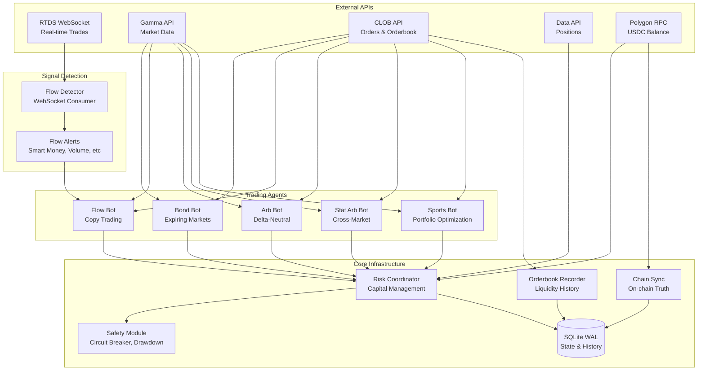

# Polymarket Analytics

Multi-agent trading infrastructure for Polymarket prediction markets.

```
Strategies: Bond | Flow | Arbitrage | Stat Arb | Sports Portfolio
Features:   Atomic capital reservation | Real-time flow detection | On-chain sync | Orderbook recording
```

---

## Architecture Overview



---

## Quick Start

```bash
# Setup
git clone <repo-url> && cd polymarket-analytics
python3 -m venv venv && source venv/bin/activate
pip install -r requirements.txt
cp .env.example .env  # Add your keys

# Run bots (dry-run first) - all use unified entry point
python scripts/run_bot.py bond --dry-run
python scripts/run_bot.py flow --dry-run
python scripts/run_bot.py arb --dry-run
python scripts/run_bot.py stat-arb --dry-run
python scripts/run_bot.py sports --dry-run

# Monitor
python scripts/risk_monitor.py status
```

---

## Strategies

### Bond Strategy (Expiring Markets)

Buys markets at 95-98c near expiration, expecting resolution to $1.

```bash
python scripts/run_bot.py bond --dry-run --interval 10
python scripts/run_bot.py bond --agent-id bond-1 --min-price 0.94 --max-price 0.99
```

### Flow Strategy (Copy Trading)

Copies unusual flow from smart money, oversized bets, coordinated wallets.

```bash
python scripts/run_bot.py flow --dry-run --min-score 30
python scripts/run_bot.py flow --agent-id flow-1 --category crypto
```

### Arbitrage Strategy (Delta-Neutral)

Risk-free arbitrage on binary markets where both sides sum to < $1.

```bash
python scripts/run_bot.py arb --dry-run
python scripts/run_bot.py arb --min-edge 50 --order-size 50
```

### Statistical Arbitrage (Cross-Market)

Cross-market arbitrage scanner with multiple strategy types:

| Type | Description |
|------|-------------|
| **Multi-Outcome** | Sum != 100% arbitrage |
| **Duplicate** | Same question, different prices |
| **Pair Spread** | Mean reversion on correlated pairs |
| **Conditional** | P(A\|B) mispricings |

```bash
python scripts/run_bot.py stat-arb --dry-run
python scripts/run_bot.py stat-arb --dry-run --types pair_spread,multi_outcome
python scripts/run_bot.py stat-arb --entry-z 2.5 --exit-z 0.3
```

### Sports Portfolio

ML-based portfolio optimization for sports markets with correlation modeling.

```bash
python scripts/run_bot.py sports --dry-run
python scripts/run_bot.py sports --dry-run --sports nba,nfl --capital 200
python scripts/run_bot.py sports --min-sharpe 0.5 --max-portfolios 3
```

---

## Data Recording

### Orderbook Liquidity Recording

Records orderbook snapshots for backtesting with realistic liquidity:

```bash
# Run enhanced recorder (WebSocket + polling + auto-backfill)
python scripts/record_orderbooks_enhanced.py

# High-volume markets only
python scripts/record_orderbooks_enhanced.py --min-volume 10000 --min-liquidity 5000

# Polling only (no WebSocket)
python scripts/record_orderbooks_enhanced.py --no-websocket

# View stats and gaps
python scripts/record_orderbooks_enhanced.py stats
python scripts/record_orderbooks_enhanced.py gaps
```

Features:
- WebSocket streaming with polling fallback
- Exponential backoff reconnection (1s-60s)
- Gap tracking and auto-backfill
- High-volume market filtering

---

## Risk Management

| Limit | Value | Description |
|-------|-------|-------------|
| Wallet Exposure | 80% | Max total exposure |
| Agent Exposure | 40% | Max per trading agent |
| Market Exposure | 15% | Max per single market |
| Daily Drawdown | 10% | Stop trading for day |
| Total Drawdown | 25% | Stop trading entirely |
| Circuit Breaker | 5 | Consecutive failures |

### Monitoring Commands

```bash
python scripts/risk_monitor.py status         # Wallet & risk overview
python scripts/risk_monitor.py agents         # List agents
python scripts/risk_monitor.py positions      # Open positions
python scripts/risk_monitor.py drawdown       # Drawdown status
python scripts/risk_monitor.py sync           # Force chain sync
python scripts/risk_monitor.py reset-drawdown # Reset DD tracking
python scripts/risk_monitor.py stop-all       # Emergency stop
```

---

## Backtesting

```bash
# Run backtests (unified CLI)
python -m polymarket.backtesting run --strategy bond --backtest
python -m polymarket.backtesting run --strategy flow --backtest
python -m polymarket.backtesting run --strategy arb --backtest
python -m polymarket.backtesting run --strategy stat-arb --backtest
python -m polymarket.backtesting run --strategy sports --backtest

# Parameter optimization (Bayesian, anti-overfitting)
python -m polymarket.backtesting run --strategy bond --optimize -n 50
python -m polymarket.backtesting run --strategy flow --optimize -n 50

# Custom lookback and capital
python -m polymarket.backtesting run --strategy arb --backtest --days 90 --capital 5000
```

**Anti-Overfitting:** 3 parameters only, walk-forward validation, L2 regularization.

---

## Project Structure

```
polymarket-analytics/
├── polymarket/
│   ├── core/                      # Shared infrastructure
│   │   ├── api.py                 # Async Polymarket API client
│   │   ├── config.py              # Configuration management
│   │   ├── models.py              # All dataclasses (incl. MultiLegSignal)
│   │   └── rate_limiter.py        # Sliding window limiter
│   │
│   ├── trading/                   # Live trading
│   │   ├── bot.py                 # TradingBot (composition-based)
│   │   ├── risk_coordinator.py    # Multi-agent risk management
│   │   ├── chain_sync.py          # On-chain transaction sync
│   │   ├── safety.py              # Circuit breaker, drawdown
│   │   ├── storage/sqlite.py      # SQLite persistence (WAL)
│   │   └── components/            # Pluggable components
│   │       ├── executors.py       # Execution engines (incl. MultiLegExecutor)
│   │       ├── position_managers.py # Multi-leg position management
│   │       └── ...                # signals, sizers, exit strategies
│   │
│   ├── strategies/                # Strategy implementations
│   │   ├── factories.py           # Unified bot factory (all strategies)
│   │   ├── bond_strategy.py       # Expiring markets
│   │   ├── flow_strategy.py       # Flow copy trading
│   │   ├── arb_strategy.py        # Delta-neutral arb
│   │   ├── stat_arb/              # Statistical arbitrage
│   │   └── sports_portfolio/      # Sports portfolio optimization
│   │
│   ├── data/                      # Data storage
│   │   ├── orderbook_storage.py   # Orderbook history DB
│   │   └── orderbook_websocket.py # WebSocket client
│   │
│   ├── flow_detector.py           # Real-time flow detection
│   │
│   └── backtesting/               # Backtesting framework
│       ├── __main__.py            # Unified CLI entry point
│       ├── runner.py              # BacktestRunner with strategy registry
│       ├── strategies/            # Strategy backtests
│       └── data/                  # Price/trade cache
│
├── scripts/                       # CLI tools
│   ├── run_bot.py                 # Unified bot entry (all strategies)
│   ├── record_orderbooks_enhanced.py  # Orderbook recorder
│   └── risk_monitor.py            # Monitoring CLI
│
└── data/                          # SQLite databases
    ├── risk_state.db              # Trading state
    └── orderbook_history.db       # Orderbook snapshots
```

---

## Configuration

```bash
# .env file
PRIVATE_KEY=0x...
POLYMARKET_PROXY_ADDRESS=0x...
POLYGON_RPC_URL=https://polygon-rpc.com

# Risk limits
MAX_WALLET_EXPOSURE_PCT=0.80
MAX_PER_AGENT_EXPOSURE_PCT=0.40
MAX_PER_MARKET_EXPOSURE_PCT=0.15
MAX_DAILY_DRAWDOWN_PCT=0.10
MAX_TOTAL_DRAWDOWN_PCT=0.25
CIRCUIT_BREAKER_FAILURES=5
```

---

## API Reference

| API | Base URL | Purpose | Rate Limit |
|-----|----------|---------|------------|
| **RTDS WebSocket** | `wss://ws-live-data.polymarket.com` | Real-time trades | N/A |
| **CLOB WebSocket** | `wss://ws-subscriptions-clob.polymarket.com` | Orderbook updates | N/A |
| **Gamma API** | `https://gamma-api.polymarket.com` | Market metadata | 4,000/10s |
| **CLOB API** | `https://clob.polymarket.com` | Orderbook, orders | 9,000/10s |
| **Data API** | `https://data-api.polymarket.com` | Positions, history | 1,000/10s |

---

## Troubleshooting

| Issue | Solution |
|-------|----------|
| Bot not starting | Check `.env` has `PRIVATE_KEY` and `POLYMARKET_PROXY_ADDRESS` |
| Rate limit errors | Increase `--interval`, check API limits |
| Phantom drawdown | Run `python scripts/risk_monitor.py reset-drawdown` |
| No signals | Lower `--min-score`, wait for flow detector warmup (~1 min) |
| Circuit breaker | Run `python scripts/risk_monitor.py cleanup` to reset |
| Orderbook gaps | Run `python scripts/record_orderbooks_enhanced.py gaps` for backfill status |
| List strategies | Run `python scripts/run_bot.py --help` for all options |

---

## License

MIT
